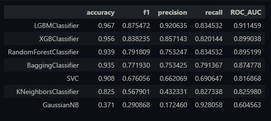
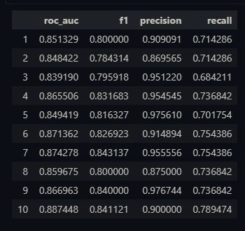
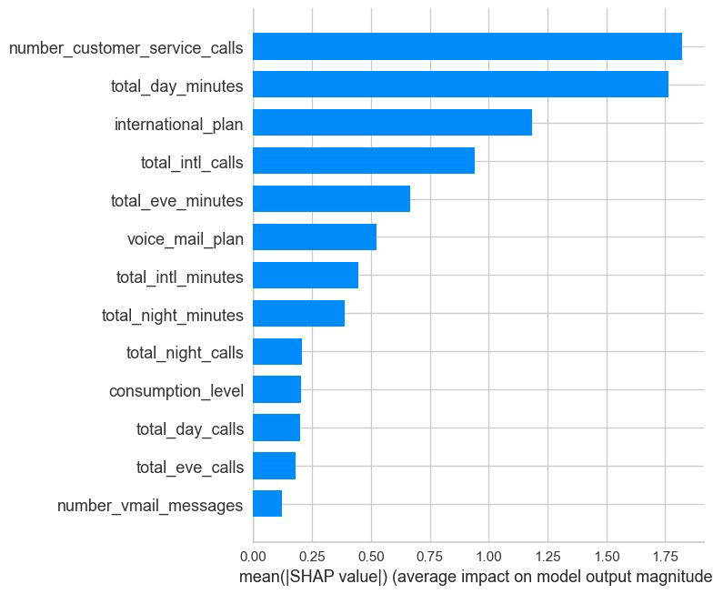
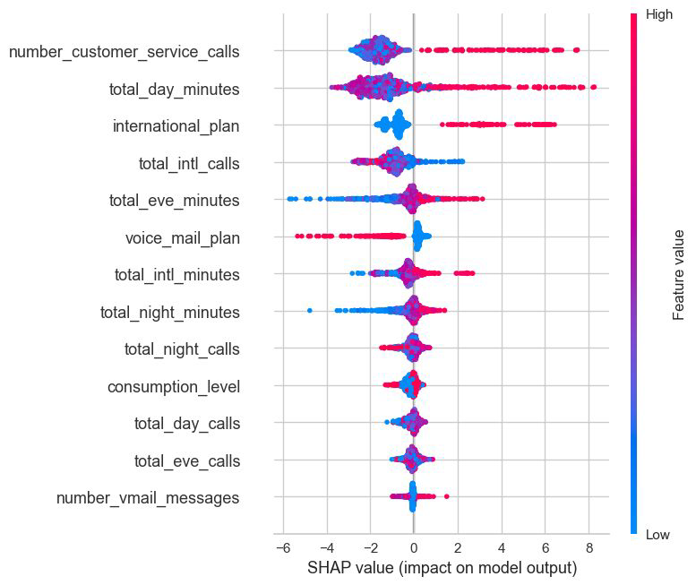

# Churn Classification 

Challenge: To predict the churn rate of a Telecom Company.


## Installation 
First clone the github repo and then run the following commands
```
cd churn_classification_del
conda create -n tests python=3.9
conda activate tests
pip3 install -r requirements.txt
```

## Key Points
- New categorical variable was created based on the median total day minutes, creating 2 consumption group - High and Low. 
- Imbalanced dataset was handled using SMOTE
- Evaluation Metric chosen: F1 score and ROC AUC score.
    - F1 offers a balance between precision and recall.
    - ROC AUC helps understand the model's discriminative ability.
- To validate the model, the best LightGBM model parameters were taken and applied on the original imbalanced data to test how the model performs across 10 different folds


## Modelling Results

This is the test evaluation metrics for the different ML models tried in this analysis. From this we can see that LightGBM and XGboost are the best performing models. 



This is the results on the holdout set from the 10 fold Stratified Cross validation done with the best parameters of the LGBM model obtained after Hyperparameter tuning. 




## Influential Predictors 
Most influential factors are number of customer service calls, total day minutes, international plan. An increase in these 3 factors increased the probability of Churn.
1. Number of customer service calls: High value indicates customer dissatisfaction, more likely to quit
2. Total day minutes: High values indicate a lot of use at which point the user may not like the plan or price they are paying
3. International plan: If this variable is True, then the user might be travelling a lot and the specific international plan may not meet their needs.






## Conclusion
- Best performing model was the LightGBM model with an average F1 score of 0.8179 and average ROC AUC score of 0.8614.
- The most influential predictors are customer service calls, total day minutes,
international plan and here are some business strategies to address them
respectively
    - Enhance Customer Support Quality, Improve Resolution Times,
    - Review Pricing Plans, Explore bundled packages
    - Competitive pricing plans, better international packages
